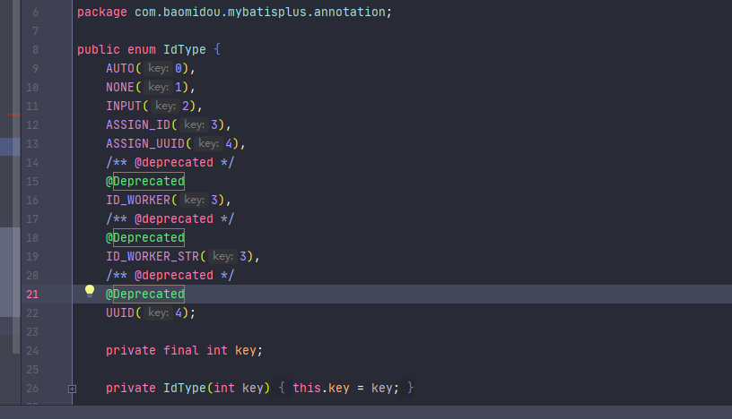
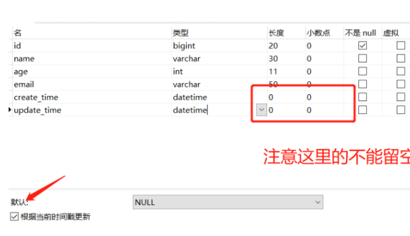

# MybatisPlus


## Quick Start

官网地址：

https://baomidou.com/guide/quick-start.html#%E5%88%9D%E5%A7%8B%E5%8C%96%E5%B7%A5%E7%A8%8B


导入依赖

```xml
 <dependency>
        <groupId>com.baomidou</groupId>
        <artifactId>mybatis-plus-boot-starter</artifactId>
        <version>3.0.5</version>
    </dependency>
```


数据库配置

```properties
spring.datasource.driver-class-name=com.mysql.cj.jdbc.Driver
spring.datasource.url=jdbc:mysql://localhost:3306/mybatis2?useUnicode=true&characterEncoding=utf-8&useSSL=false&serverTimezone = GMT
spring.datasource.username=root
spring.datasource.password=990201
```


pojo

```java
/**
 * @author Simple
 * @data 2021/3/25 11:20
 */
@Data
@AllArgsConstructor
@NoArgsConstructor
@ToString
public class User {
    private Long id;
    private String name;
    private Integer age;
    private String email;
}
```


mapper接口

```java
/**
 * @author Simple
 * @data 2021/3/25 11:22
 */

// 在对应的Mapper上面实现基本的接口BaseMapper
@Repository  // 代码持久层
@Mapper
public interface UserMapper extends BaseMapper<User> {
    // 所有的CRUD操作都已经编写完成了
    // 你不需要像以前那样配置一大堆文件了
}
```


主启动类

```java
@MapperScan("com.simple.mybatispluslearn.mapper")
@SpringBootApplication

public class MybatispluslearnApplication {

    public static void main(String[] args) {
        SpringApplication.run(MybatispluslearnApplication.class, args);
    }

}
```


测试类

```java
@Test
public void testSelect() {
    System.out.println(("----- selectAll method test ------"));

    // 查询全部用户
    // selectList(参数) 这里的参数是一个Wrapper，条件构造器，这里我们先不用，写个null占着

    List<User> userList = userMapper.selectList(null);
    Assert.assertEquals(5, userList.size());
    userList.forEach(System.out::println);
}
```


## 配置日志

我们所有的Sql现在是不可见的，我们希望知道它是怎么执行的，所以我们必须要看日志！


```properties
mybatis-plus.configuration.log-impl=org.apache.ibatis.logging.stdout.StdOutImpl
```


## CRUD拓展


### Insert

```java
@Test
public void testInsert(){
    User user = new User();
    user.setName("Simple");
    user.setAge(20);
    user.setEmail("1372713212@qq.com");
    int result = userMapper.insert(user);  // 帮我们自动生成id
    System.out.println(result); // 受影响的行数
    System.out.println(user); // 发现，id自动回填
}
```


> 数据库插入id的默认值为：全局唯一ID


### **主键生成策略**

设置对应数据库中的主键方法：uuid、自增id、雪花算法、redis、zookeeper

分布式系统唯一ID生成方案：https://www.cnblogs.com/haoxinyue/p/5208136.html

> id_worker 全局唯一（注意:mybatisplus高版本不再使用了）  @TableId(type = IdType.ID_WORKER)



>  **雪花算法**

snowflake是Twitter开源的分布式ID生成算法，结果是一个long型的ID。其核心思想是：使用41bit作为毫秒数，10bit作为机器的ID（5个bit是数据中心，5个bit的机器ID），12bit作为毫秒内的流水号（意味着每个节点在每毫秒可以产生 4096 个 ID），最后还有一个符号位，永远是0。


> **主键自增**

我们需要配置主键自增：

1、实体类字段上增加 `@TableId(type = IdType.AUTO)`

2、数据库字段一定要是设置自增的！


其余的源码解释


```java
public enum IdType {
    AUTO(0),  // 数据库id自增
    NONE(1),  // 未设置主键
    INPUT(2), // 默认方案,手动输入
    ID_WORKER(3), // 默认的全局id
    UUID(4),  // 全局唯一id
    ID_WORKER_STR(5); // ID_WORKER 字符串表示法
}
```


改为手动输入之后，就需要自己配置id

```java
public class User {

    // 对应数据库的主键（uuid、自增id、雪花算法、redis、zookeeper）
    @TableId(type = IdType.INPUT)  // 默认方案
    private Long id;
    private String name;
    private Integer age;
    private String email;
}

```


### Update


```java
   // 测试更新
    @Test
    public void testUpdate(){
        User user = new User();
        user.setId(5L);
        user.setName("SimpleNiubi");
        user.setAge(100);
        // 注意： updateById 但是参数是一个对象
        int i = userMapper.updateById(user);
        User user1 = userMapper.selectById(5L);
        System.out.println(user1);
        System.out.println("受影响的行数"+i);
    }
```


自动填充

创建时间、修改时间！这些个操作一般都是自动化完成的，我们不希望手动更新！

阿里巴巴开发手册：所有的数据库表：gmt_create 、gmt_modify几乎所有的表都要配置上，而且需要自动化！


>  方式一：数据库级别的修改 （工作中是不允许你修改数据库）

1、在表中新增字段create_time、update_time



2、再次测试插入方法，我们需要先把实体类同步！

```java
public class User {

    @TableId(type = IdType.AUTO)
    private Long id;
    private String name;
    private Integer age;
    private String email;

    private Date create_time;
    private Date update_time;
}
```


> 方式二：代码级别


1.删除数据库的默认值，更新操作


2.实体类字段属性上需要增加注解


```java
// 字段添加填充内容
@TableField(fill = FieldFill.INSERT)
private Date create_time;
@TableField(fill = FieldFill.INSERT_UPDATE)
private Date update_time;

```

3.编写处理器来处理这个注解即可！

由于这个处理器在Springboot下面， mybatis会自动处理我们写的所有的处理器

当我们执行插入操作的时候，自动帮我们通过反射去读取哪边有对应注解的字段，从而把处理器代码插入成功，会自动帮我把createTime，updateTime插入值

```java
/**
 * @author Simple
 * @data 2021/3/25 20:46
 */

@Slf4j
@Component  // 一定不要忘记把处理器加到IOC容器中！
public class MyMetaObjectHandler implements MetaObjectHandler {

    // 插入时的填充策略
    @Override
    public void insertFill(MetaObject metaObject) {
        log.info("start insert fill.....");
        // setFieldValByName(String fieldName, Object fieldVal, MetaObject metaObject)
        this.setFieldValByName("createTime",new Date(),metaObject);
        this.setFieldValByName("updateTime",new Date(),metaObject);
    }
    // 更新时的填充策略
    @Override
    public void updateFill(MetaObject metaObject) {
        this.setFieldValByName("updateTime",new Date(),metaObject);
    }
}
```


4.测试插入

5.测试更新、观察时间即可


### 乐观锁

> 乐观锁 **OptimisticLockerInnerInterceptor**

乐观锁：当要更新一条记录的时候，希望这条记录没有被别人更新
乐观锁实现方式：

+ 取出记录时，获取当前version
+ 更新时，带上这个version
+ 执行更新时， set version = newVersion where version = oldVersion
+ 如果version不对，就更新失败‘

```sql
乐观锁：1、先查询，获得版本号 version = 1
-- A
update user set name = "xiaoshaung",version = version + 1
where id = 2 and version = 1

-- B 线程抢先完成，这个时候 version = 2 ，会导致 A 修改失败！
update user set name = "小爽"，version = version + 1
where id = 2 and version = 1

```


>  测试Mybatis-Plus的乐观锁实现

1、给数据库中增加version字段


2、实体类加对应的字段

```java
//乐观锁version注解 
@Version  
private Integer version;

```

3、注册组件(最新版本)

```
@MapperScan("com.simple.mybatispluslearn.mapper")
@EnableTransactionManagement  // 自动开启事务管理
@Configuration // 配置类
class MybatiPlusConfig {
    @Bean
    public MybatisPlusInterceptor mybatisPlusInterceptor(){
        MybatisPlusInterceptor interceptor = new MybatisPlusInterceptor();
        interceptor.addInnerInterceptor(new OptimisticLockerInnerInterceptor());
        return interceptor;
    }
}
```

4、测试一下乐观锁的使用

```java
   // 测试乐观锁单线程成功
   @Test
   public void testOptimisticLock(){
       // 1、查询用户信息
       User user = userMapper.selectById(1);
       // 2、修改用户信息
       user.setName("simple");
       user.setEmail("123123132@qq.com");
       // 3、执行更新操作
       userMapper.updateById(user);
   }

   // 测试乐观锁多线程失败  多线程
/*
线程1 虽然执行了赋值语句，但是还没进行更新操作，线程2就插队了抢先更新了，
由于并发下，可能导致线程1执行不成功
如果没有乐观锁就会覆盖线程2的值
*/
   @Test
   public void testOptimisticLock2(){
       // 线程1
       User user = userMapper.selectById(1);
       user.setName("simpleniubi");
       user.setEmail("123123132@qq.com");

       // 模拟另外一个线程执行了插队操作
       // 线程2
       User user2 = userMapper.selectById(1);
       user2.setName("simpleNIUbi");
       user2.setEmail("123123132@qq.com");
       userMapper.updateById(user2);

       // 自旋锁来多次尝试提交
       userMapper.updateById(user);   //如果没有乐观锁就会覆盖插队线程的值
   }
```


### Select

```jade
 // 测试查询
    @Test
    public void testSelectById(){
        // 查询一个
        User user = userMapper.selectById(1);
        // 查询批量查询
        List<User> users = userMapper.selectBatchIds(Arrays.asList(1, 2, 3));
        users.forEach(System.out::println);
        System.out.println(user);
    }
// 条件查询 map
@Test
public void testSelectByBatchIds(){
    HashMap<String, Object> map = new HashMap<>();
    // 自定义要查询的条件
    map.put("name","宇智波佐助");
    List<User> users = userMapper.selectByMap(map);
    users.forEach(System.out::println);
}
// 条件查询 map
@Test
public void testSelectByBatchIds(){
    HashMap<String, Object> map = new HashMap<>();
    // 自定义要查询的条件
    map.put("name","Tom");
    map.put("age","28");
    List<User> users = userMapper.selectByMap(map);
    users.forEach(System.out::println);
}

```


分页查询

1. 原始的limit 进行分页
2. pageHepler 第三方插件
3. Mybatis-Plus其实也内置了分页插件！

> 如何使用分页插件

1、拦截器组件即可

```java
public class MybatisPlusConfig {
    // 分页插件
    @Bean
    public PaginationInterceptor paginationInterceptor() {

        return new PaginationInterceptor();
    }
}

```

2、直接使用Page对象即可！测试


```java
// 测试分页查询
@Test
public void testPage(){
    // 参数1 当前页 ；参数2 页面大小
    Page<User> page = new Page<>(1,5);
    userMapper.selectPage(page,null);

    page.getRecords().forEach(System.out::println);
    System.out.println("getCurrent()"+page.getCurrent());
    System.out.println("page.getSize()"+page.getSize());
    System.out.println("page.getTotal()"+page.getTotal());
}
其实每次做分页查询之前都会进行总数查询
```


### Delete

```java
// 测试删除
@Test
public void testDeleteId(){
    userMapper.deleteById(1367357737224667139L );
}
// 批量删除
@Test
public void testDeleteBatchId(){
    userMapper.deleteBatchIds(Arrays.asList(1367357737224667142L,1367357737224667143L));
}
//通过map删除
@Test
public void testDeleteMap(){
    HashMap<String, Object> map = new HashMap<>();
    map.put("id","1367357737224667144");
    userMapper.deleteByMap(map);
}

```

### 逻辑删除

> 物理删除：从数据库中直接移除
>
> 逻辑删除：再数据库中没有被移除，而是通过一个变量来让它失效！ deleted = 0 => deleted = 1
>
> 说明:
>
> 只对自动注入的sql起效:
>
> 插入: 不作限制
> 查找: 追加where条件过滤掉已删除数据,且使用 wrapper.entity 生成的where条件会忽略该字段
> 更新: 追加where条件防止更新到已删除数据,且使用 wrapper.entity 生成的where条件会忽略该字段
> 删除: 转变为 更新
> 例如:
>
> 删除: update user set deleted=1 where id = 1 and deleted=0
> 查找: select id,name,deleted from user where deleted=0
> 字段类型支持说明:
>
> 支持所有数据类型(推荐使用 Integer,Boolean,LocalDateTime)
> 如果数据库字段使用datetime,逻辑未删除值和已删除值支持配置为字符串null,另一个值支持配置为函数来获取值如now()
> 附录:
>
> 逻辑删除是为了方便数据恢复和保护数据本身价值等等的一种方案，但实际就是删除。
> 如果你需要频繁查出来看就不应使用逻辑删除，而是以一个状态去表示。

管理员可以查看被删除的记录！ 防止数据的丢失，类似于回收站！

测试一下：

在数据表中增加一个deleted字段


实体类中增加字段

```java
// 逻辑删除注解
@TableLogic
private Integer deleted;

```

配置(3.3以上版本不需要配置Bean)


```java
public class MybatisPlusConfig {
    // 逻辑删除组件
    @Bean
    public ISqlInjector iSqlInjector(){
        return new LogicSqlInjector();
    }
}

```

```properties
# 配置逻辑删除
mybatis-plus.global-config.db-config.logic-delete-value= 1
mybatis-plus.global-config.db-config.logic-not-delete-value= 0

```

测试一下删除

发现记录还在数据库中，但是deleted已经变化了

让我们来重新查询刚才被删除的记录


###  执行 SQL 分析打印


 第一步：导入相应的依赖

```java
<dependency>
    <groupId>p6spy</groupId>
    <artifactId>p6spy</artifactId>
    <version>3.8.1</version>
</dependency>
```

 第二步：编写yml配置文件

- 关键点1：url需要加上p6spy 固定的是jdbc:p6spy:数据库名…
- 关键点2：driver-class-name指定的是p6spy的驱动

```properties
spring:
  datasource:
    username: root
    password: root
    url: jdbc:p6spy:mysql://localhost:3306/mybatis_plus?serverTimezone=GMT%2B8&useSSL=false&useUnicode=true&charcterEncoding=UTF-8
    driver-class-name: com.p6spy.engine.spy.P6SpyDriver

```

 第三步，编写p6spy的核心配置文件spy.properties

- 关键点，一定要通过driverlist指定真实的JDBC驱动

```properties
#3.2.1以上使用
modulelist=com.baomidou.mybatisplus.extension.p6spy.MybatisPlusLogFactory,com.p6spy.engine.outage.P6OutageFactory
#3.2.1以下使用或者不配置
#modulelist=com.p6spy.engine.logging.P6LogFactory,com.p6spy.engine.outage.P6OutageFactory
# 自定义日志打印
logMessageFormat=com.baomidou.mybatisplus.extension.p6spy.P6SpyLogger
#日志输出到控制台
appender=com.baomidou.mybatisplus.extension.p6spy.StdoutLogger
# 使用日志系统记录 sql
#appender=com.p6spy.engine.spy.appender.Slf4JLogger
# 设置 p6spy driver 代理
deregisterdrivers=true
# 取消JDBC URL前缀
useprefix=true
# 配置记录 Log 例外,可去掉的结果集有error,info,batch,debug,statement,commit,rollback,result,resultset.
excludecategories=info,debug,result,commit,resultset
# 日期格式
dateformat=yyyy-MM-dd HH:mm:ss
# 实际驱动可多个
#driverlist=org.h2.Driver
# 是否开启慢SQL记录
outagedetection=true
# 慢SQL记录标准 2 秒
outagedetectioninterval=2
# 真实JDBC driver
driverlist=com.mysql.cj.jdbc.Driver

```


### 条件构造器


十分重要：Wrapper

我们写一些复杂的sql就可以使用它来替代！

#### 非空 大于

```java
@Test
void contextLoads(){
    // 查询 name 不为空的用户，并且邮箱不为空的用户，年龄大于等于20
    QueryWrapper<User> wrapper = new QueryWrapper<>();
    wrapper
            .isNotNull("name")
            .isNotNull("email")
            .ge("age",20);
    userMapper.selectList(wrapper).forEach(System.out::println);
}

```

#### 查询一个名字

```java
@Test
void getOneName(){
    // 查询名字 simple
    QueryWrapper<User> wrapper = new QueryWrapper<>();
    wrapper.eq("name","simple");  // 查询一个数据
    userMapper.selectOne(wrapper);
}

```

#### 使用between

```java
@Test
void betweenTest(){
    QueryWrapper<User> wrapper = new QueryWrapper<>();
    wrapper.between("age",25 ,100);
    Integer count = userMapper.selectCount(wrapper);// 查询结果数
    System.out.println(count);
}

```

#### like模糊查询

```java
// 模糊查询
@Test
void likeTest(){
    QueryWrapper<User> wrapper = new QueryWrapper<>();
    // 左和右
    wrapper.notLike("name","帅")
           .likeRight("name","小");
    List<Map<String, Object>> maps = userMapper.selectMaps(wrapper);
    maps.forEach(System.out::println);
}
这里查询的是 name 中不带“帅”字，且模糊查询为 “小%”，
```

#### 连接查询（内查询）

```java
// 内查询
@Test
void innerJoinTest(){
    QueryWrapper<User> wrapper = new QueryWrapper<>();
    // id 在子查询中查找出来的
    wrapper.inSql("id","select id from user where id<3");
    List<Object> users = userMapper.selectObjs(wrapper);
    users.forEach(System.out::println);
}

```

#### 升序排序

```java
// 通过id进行排序
@Test
void orderById(){
    QueryWrapper<User> wrapper = new QueryWrapper<>();
    //
    wrapper.orderByDesc("id");
    List<Object> objects = userMapper.selectObjs(wrapper);
    objects.forEach(System.out::println);
}

```


## 代码自动生成器

dao、pojo、service、controller 都自己编写完成

AutoGenerator 是 MyBatis-Plus 的代码生成器，通过 AutoGenerator 可以快速生成 Entity、Mapper、Mapper XML、Service、Controller 等各个模块的代码，极大的提升了开发效率。
